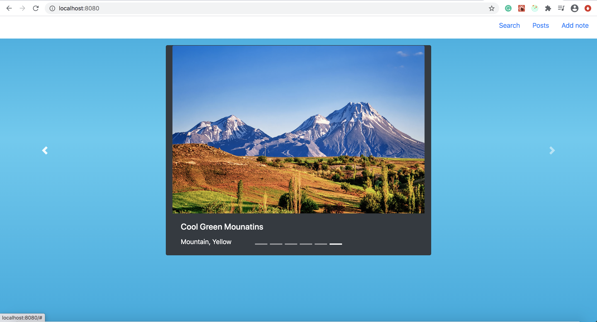
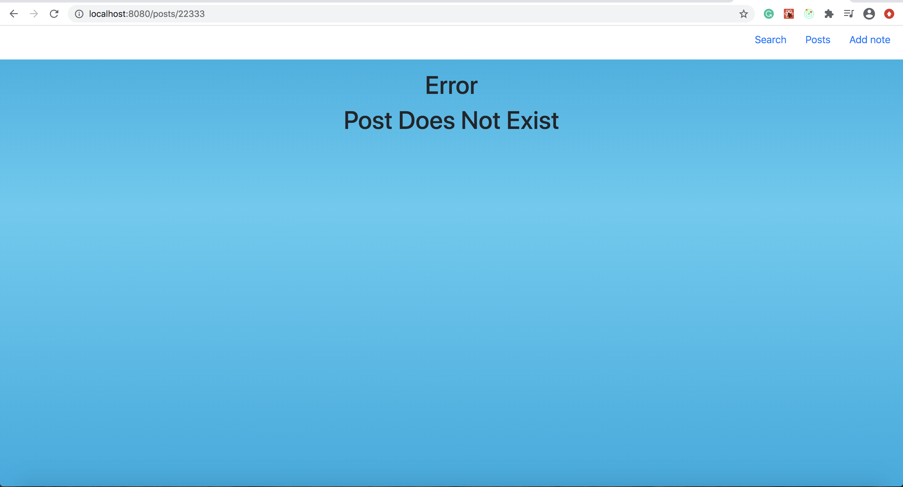
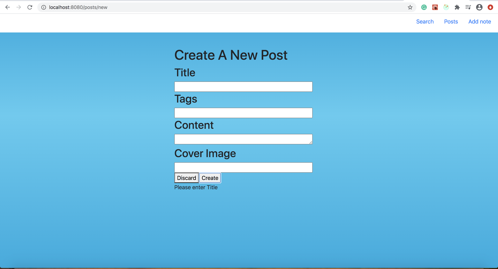
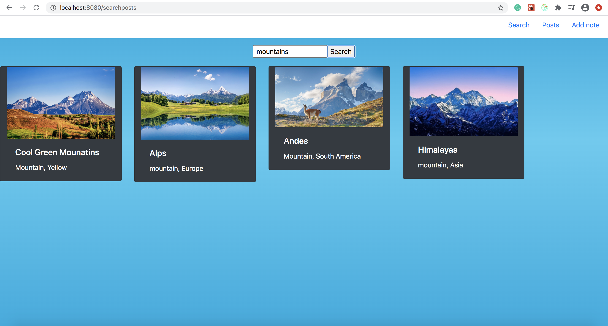

# Redux Platform

For redux platform I used redux and the CRUD api to create a blog/image viewer application that allows you to add, view and search through images and blogs. The platform functions by making api calls through redux actions and uses reducers to set redux state with the post information, which is then used. The platform also uses bootstrap for some styling. 

## What Worked Well
I found redux to be very intuitive and fairly easy to understand. The concept of actions, reducers and global state were really easy to understand. Even though it can take some time to set up redux is definately better for larger projects. With just simple react I would have to remember where everything was coming from, but with redux everything was simplified. Since this lab was kind of similar to the react notes lab I was able to use some of the concepts from that lab on this one. 

## What Didn't
I used bootstrap for some styling and there was definately a learning curve to it. I had to go through a lot of trial and error to get bootstrap working. My update function was also being slow. Turns out it was because I was updating onChange. Somebody else had the same problem and Tim wrote on slack that this api is slower than firebase so updating onChange might be slow and to instead update at the end on a click. I did that and it worked perfectly, but I did have to rewrite some code. 

## Extra Credit
1.  I made it something other than a blog. I created a image slide viewer. I used bootstrap to create a slider that can be operated with on screen arrows and the keyboard. It still has all the CRUD features. The slider displays images in a carousel.  

2.  I also handle axios errors and show error on screen. I created a new reducer and new error actions and error states. So now if you try to navigate to a post, edit or delete a post that does not exist it will show error, post does not exist.  

3.  I also added input validation. If you try to create a post without a Title it wont let you, and will ask you to input a title.  

4.  I also added a search button to filter posts. I used a plugin called fuse.js to search the posts both by tag and title. Once you input your query and hit search it will show all matching items in order in column view. 

